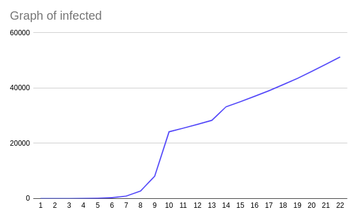

# Simulation of virus propagation

## Simulation programming language : Kotlin
[what's koltin](https://kotlinlang.org/)

### Go to the file config.properties
change the values of the simulation
Be careful ! Percentages are numbers between 0 and 1. 

```python
# number of person in this world
world.number = 1200000
# number of people, a person meets when they go out
world.meeting = 2
# probability to infected someone
world.probability = 0.8

# percentage of contacts ( before on containment )
world.percentageOutside = 0.7
# percentage , reduce contacts
world.percentageReduceOutside = 0.95

# number of days without containment
world.daysWithoutContainment = 10
# containment day number
world.days = 14


# number of people leaving
world.outPerson = 120

```
### Literal explanation of the configuration file 
here's my configuration, in my simulation of the world at 1 200 000 people.
Of the 1 200 000 people, 70% are in contact with 2 people . And the propagation will last 10 days.  Then there will be 14 days of confinement. That is to say that the percentage of contact will be reduced by 0.95% .

### Resulat 
```bash
Start simulation
number of infected : 1
The world is init
number of infected : 1
number of infected : 3
number of infected : 7
number of infected : 25
number of infected : 95
number of infected : 289
number of infected : 881
number of infected : 2713
number of infected : 8124
number of infected : 24164
The world is confined
number of infected : 25471
number of infected : 26849
number of infected : 28297
number of infected : 29752
number of infected : 31420
number of infected : 33210
number of infected : 35038
number of infected : 37018
number of infected : 39009
number of infected : 41235
number of infected : 43467
number of infected : 46020
number of infected : 48592
number of infected : 51267
end simulation

```


